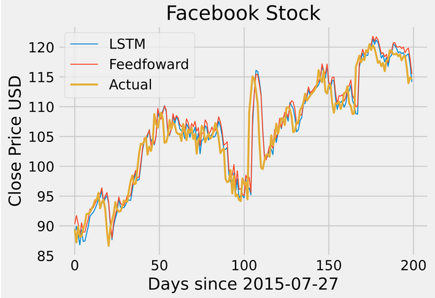

# alexV2

This is the improvement of the initial grade 12 capstone project Alex originally written from scratch in C#. The same methodology is utilized using the the LSTM model in tensorflow and data from quandl apis and more data to attempt to achieve better results. Still trying to overcome the 2% loss threshold (best 2.077) on the DOW30 companies (about 200-250k training data) and the 2.4% loss threshold (best 2.475) in the NASDAQ companies (about 500-600k training data). 

Still very much a work in progress and not inteneded for actual use. Mainly done for learning purposes about data preperation, tensorflow, LSTM, and training.

Example of a prediction on the testing data made by the 2.475% loss NASDAQ model on and also a feedfoward model trained on only one stock:

